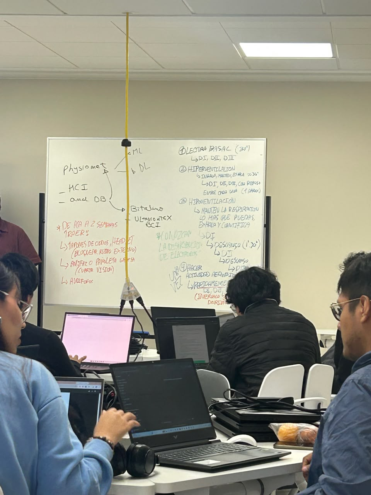
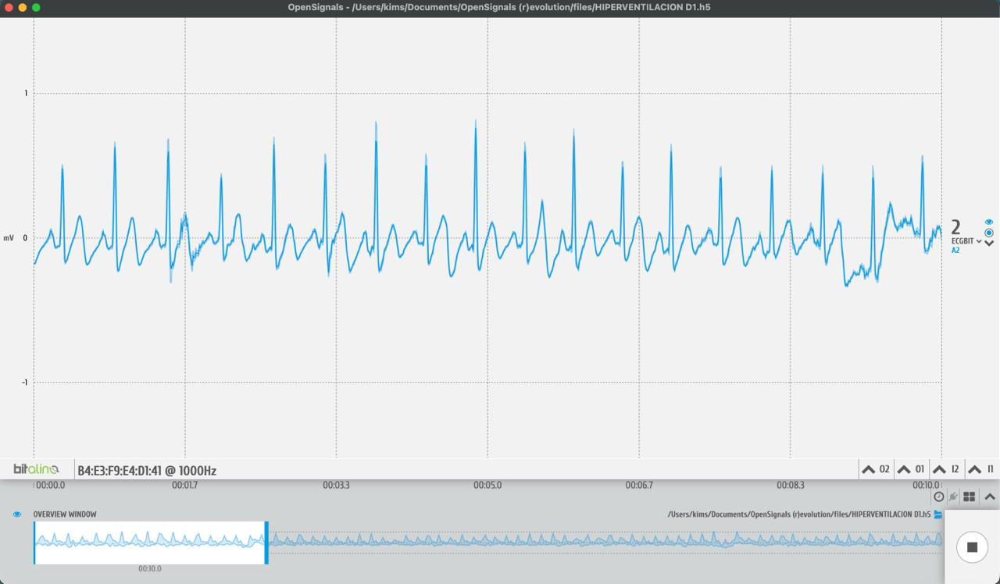
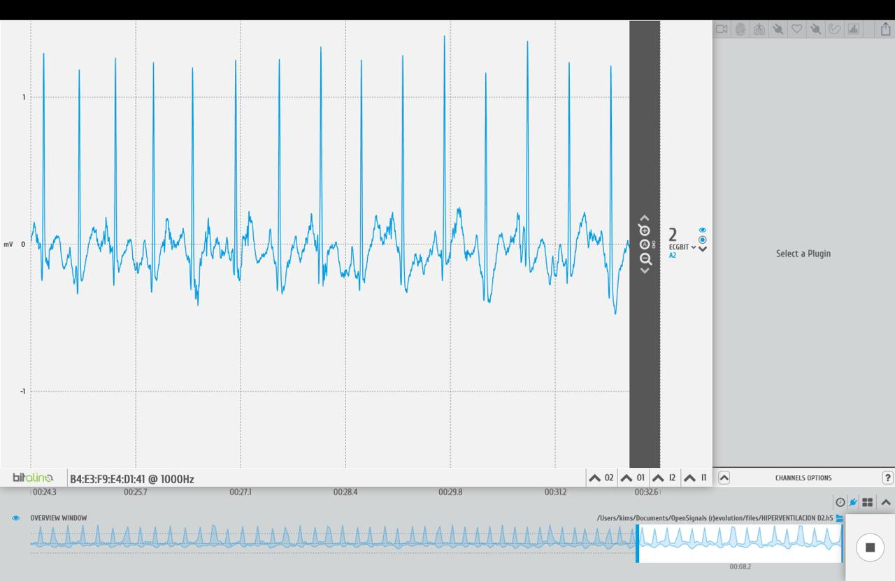
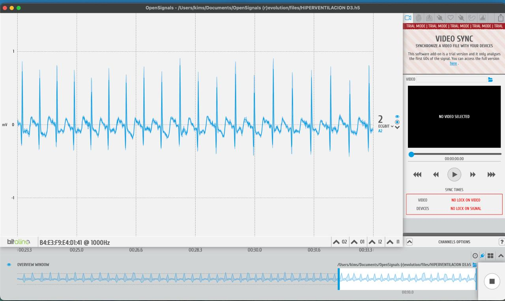
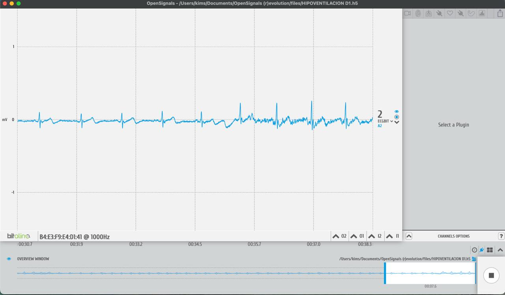
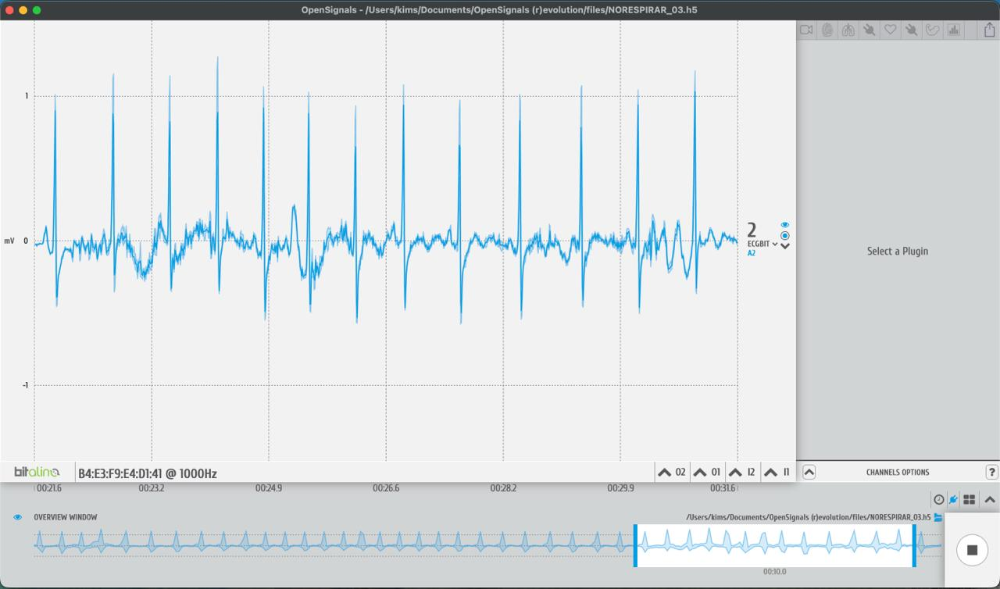
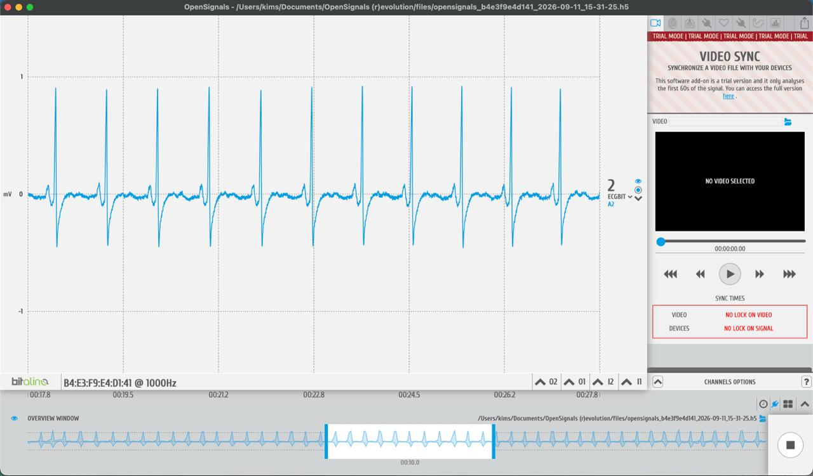
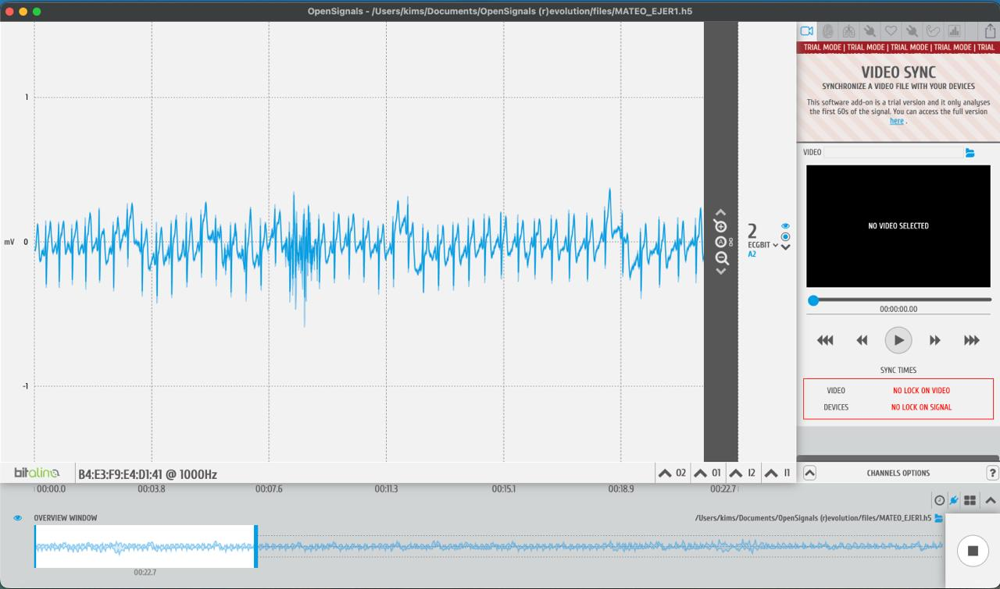
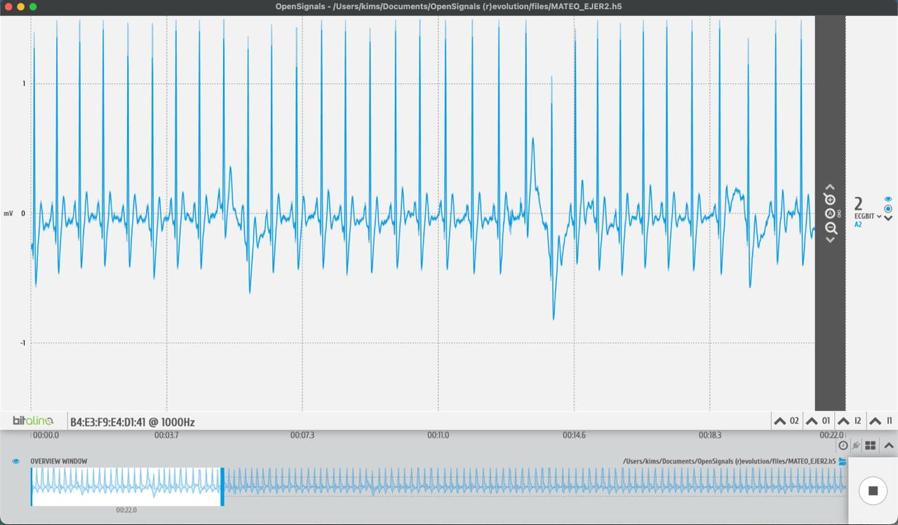
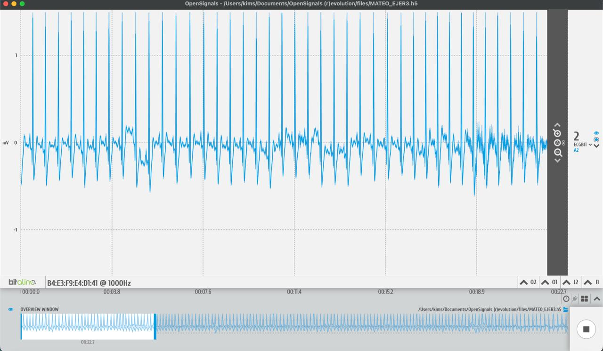

## 1. Hiperventilación (Kimberly)

El registro fue realizado durante ciclos de inhalación, mantenimiento y exhalación prolongada, con una duración aproximada de 30 segundos por ciclo.

Las señales ECG fueron adquiridas en las derivaciones DI, DII y DIII, considerando un periodo de reposo entre cada registro.

### Intento D1

Archivo correspondiente:

`HIPERVENTILACION D1.h5`

### Intento D2

Archivo correspondiente:

`HIPERVENTILACION D2.h5`

### Intento D3

Archivo correspondiente:

`HIPERVENTILACION D3.h5`

---

## 2. Hipoventilación

El registro fue realizado manteniendo voluntariamente la respiración durante el mayor tiempo posible. Posteriormente, se permitió la exhalación y recuperación antes de realizar el siguiente intento.

### Intento D1

Archivo correspondiente:

`HIPOVENTILACION D1.h5`

### Intento D2

Archivo correspondiente:

`NORESPIRAR_03.h5`

### Intento D3

Archivo correspondiente:

`opensignals_b4e3f9e4d141_2026-09-11_15-31-25.h5`

---

## 3. Actividad aeróbica (Mateo)

Las señales ECG fueron registradas inmediatamente después de realizar actividad aeróbica, con el objetivo de observar los cambios producidos por el incremento de la frecuencia cardíaca.

### Intento 1

Archivo correspondiente:

`MATEO_EJER1.h5`

### Intento 2

Archivo correspondiente:

`MATEO_EJER2.h5`

### Intento 3

Archivo correspondiente:

`MATEO_EJER3.h5`

