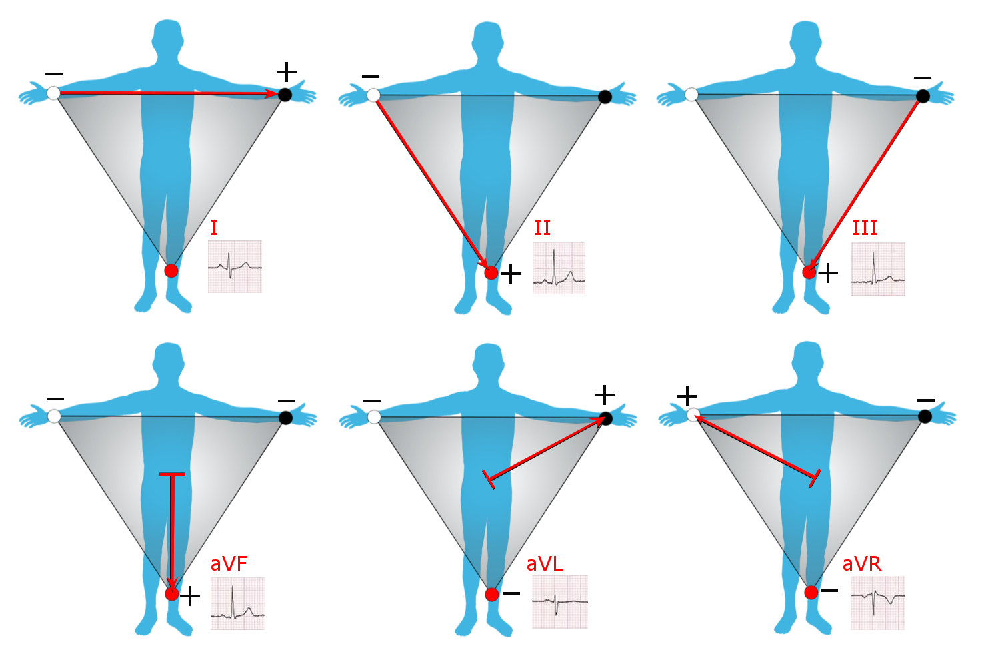

# Resumen de la sesión de laboratorio – Señal ECG
--- 
Durante la sesión se realizaron registros electrocardiográficos utilizando las derivaciones de Einthoven DI, DII y DIII. A partir de la configuración inicial, para adquirir la derivación DII se intercambiaron las posiciones del electrodo positivo (rojo) y del electrodo de referencia (blanco). Posteriormente, para obtener la derivación DIII, se intercambiaron las posiciones del electrodo negativo (negro) y del electrodo de referencia (blanco) respecto a la configuración utilizada en DII. De esta manera, se modificó la configuración de los electrodos para registrar las distintas derivaciones bipolares durante la práctica. Tambien se puede representar según la figura 1. 

 

 Figura 1. Derivaciones bipolares y unipolares 

Para el desarrollo de este laboratorio, se obtuvo una lectura basal de aproximadamente 30 segundos para cada una de las tres derivaciones, con el participante en reposo. Esta etapa permitió disponer de una señal de referencia antes de aplicar cualquier modificación en la respiración o realizar actividad física. Posteriormente se evaluó el efecto de la hiperventilación. El participante realizó una secuencia de inhalación, mantenimiento y exhalación durante aproximadamente 30 segundos. Después de esta maniobra se registraron nuevamente las derivaciones DI, DII y DIII, dejando un periodo de reposo aproximado entre cada adquisición.

A continuación, se realizó una prueba de hipoventilación, en la que el participante mantuvo la respiración durante el mayor tiempo posible. Al finalizar, se realizó la exhalación y se registró nuevamente la señal comenzando por DI, seguida de periodos de descanso antes de adquirir DII y DIII.

Finalmente, se efectuó una actividad aeróbica durante aproximadamente 5–10 minutos. Inmediatamente después del ejercicio se registraron nuevamente las tres derivaciones para observar los cambios producidos en la señal EKG, utilizando aproximadamente 30 segundos de intervalo entre cada derivación.

De esta manera, el laboratorio permitió comparar experimentalmente el ECG obtenido en reposo, hiperventilación, hipoventilación y después de actividad física, observando principalmente las variaciones en la frecuencia cardíaca, la separación entre los complejos QRS y la morfología general de la señal entre las diferentes derivaciones.
