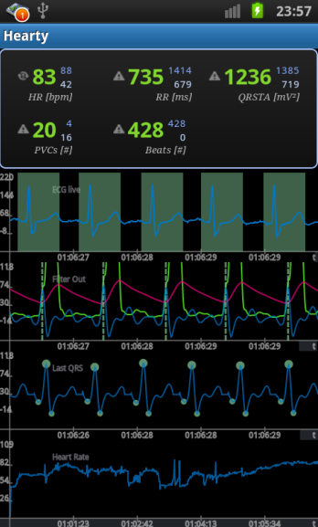

Canva del primer avance de proyecto:

## Analísis de articulo referencial 
### Resumen 
Se desarrollo una aplicación para Android que visualizaba continuamente el ECG, detectaba complejos QRS e identificaba latidos que podían considerarse anormales. La aplicación recibía datos de un sensor Shimmer por Bluetooth o reproducía registros almacenados.[1] 

#### Arquitectura y metodología del sistema
1. Adquisición de la señal ECG
Los investigadores utilizaron un sensor Shimmer para adquirir el ECG en derivación II y transmitirlo mediante Bluetooth a una aplicación Android. El sistema también podía procesar registros previamente almacenados, simulando su adquisición en tiempo real. 

2. Filtrado digital y detección QRS

Se implementó una adaptación del algoritmo de Pan-Tompkins. Primero, la señal pasa por un filtro pasa banda formado por filtros pasa bajas y pasa altas en cascada, cuyo objetivo es reducir el ruido antes de detectar los complejos QRS.
Posteriormente, se aplican una derivada de cinco puntos, una elevación al cuadrado y una integración mediante una ventana móvil. La derivada resalta los cambios rápidos del QRS; la elevación al cuadrado acentúa las pendientes pronunciadas, y la integración junta esa información para localizar cada complejo.
Para detectar los picos R, se calcula un umbral utilizando una media móvil de 150 ms, seguido de un detector de máximos de tres puntos y una verificación de los picos candidatos.[1]

3. Creación de plantillas y extracción de características

Una vez detectados los picos R, el sistema construye automáticamente dos plantillas QRS a partir de los primeros seis latidos válidos. Para ello, analiza ventanas de 400 ms centradas en cada pico R y busca latidos con áreas similares y una correlación de Pearson superior a 0.95. Las plantillas se actualizan posteriormente con los latidos clasificados como normales.
Para analizar cada nuevo latido, extrae cuatro características: diferencia de área respecto a la plantilla, correlación máxima, duración del QRS e intervalo RR. [1]

4. Detección de anomalías y visualización

Finalmente, las cuatro características se introducen en un árbol de decisiones que utiliza umbrales para identificar latidos normales o anormales y alteraciones del ritmo.[1]

#### Interfaz 
La interfaz desarrollada en el artículo presenta la señal ECG original, los complejos QRS extraídos y las variaciones de la frecuencia cardíaca. Además, muestra la frecuencia actual, el intervalo RR en milisegundos y la cantidad de QRS reconocidos. 
                                            

Tambien los  autores incorporaron indicadores de color
Verde : Latido identificado como normal.
Rojo : Latido identificado como anormal.

### Resultados 
La aplicación muestra continuamente el ECG, los complejos QRS y las variaciones de la frecuencia cardíaca. También presenta los intervalos RR y marca los latidos normales en verde y los anormales en rojo
evaluaron su aplicación utilizando las bases de datos MIT-BIH Arrhythmia y MIT-BIH Supraventricular Arrhythmia. En total, procesaron 256 014 anotaciones de latidos, correspondientes a 111 registros seleccionados. Las pruebas se realizaron en tres modelos de teléfonos Android y produjeron los mismos resultados en todos ellos. 
El algoritmo logró detectar correctamente el 99.59 % de los complejos QRS en MIT-BIH Arrhythmia y el 99.58 % en MIT-BIH Supraventricular Arrhythmia. En conjunto, solo el 0.42 % de las anotaciones no fueron reconocidas. Estos resultados muestran que el sistema consiguió localizar los latidos con una alta tasa de detección. 
Respecto a la identificación de latidos anormales, se obtuvo una sensibilidad global del 89.5 % y una especificidad del 80.6 %. Esto significa que el sistema identificó aproximadamente nueve de cada diez latidos anormales, aunque también presentó falsas alarmas al clasificar algunos latidos normales como anormales. 
Finalmente, se comprobó que la aplicación podía procesar y visualizar el ECG en tiempo real utilizando un sensor Shimmer conectado mediante Bluetooth. Sin embargo, esta prueba en vivo se realizó únicamente con una persona sana, por lo que no permitió comprobar su rendimiento clínico en pacientes con arritmias.

### Oportunidades de mejora 
Finalmente, identificamos oportunidades de mejora en el artículo a partir de las limitaciones encontradas
El algoritmo depende de la calidad de los primeros latidos, porque los utiliza para construir sus plantillas. Por eso proponemos evaluar la calidad de la señal antes de generarlas.

El sistema todavía presenta falsas alarmas. Nuestra idea es que la interfaz permita visualizar los latidos sospechosos para facilitar su revisión.
El algoritmo tiene una carga computacional elevada debido al cálculo de correlaciones. Por ello, podríamos comparar un método sencillo basado en intervalos RR con otro que también considere la morfología del QRS.
Finalmente, como las pruebas en vivo fueron limitadas y utilizaron el sensor Shimmer, proponemos comenzar con registros anotados de PhysioNet 

### Conclusiones 
Gracias al algoritmo de Pan-Tompkins, la comparación con plantillas QRS y la extracción de características temporales y morfológicas, los investigadores consiguieron integrar la adquisición, el procesamiento y la visualización de las señales en una sola aplicación.
Una de las principales limitaciones fue la dependencia de las plantillas iniciales: cuando los primeros latidos contenían ruido o alteraciones, podían generarse plantillas inadecuadas y aumentar los errores de clasificación. Asimismo, el cálculo de correlación generó una carga computacional considerable.
A partir de sus limitaciones, planteamos incorporar una evaluación inicial de la calidad de la señal y permitir que el usuario visualice los latidos señalados como sospechosos. Además, proponemos comenzar la validación con registros anotados de PhysioNet antes de considerar la adquisición en tiempo real

## Dataset: MIT-BIH Arrhythmia Database

### PhysioNet – MIT-BIH Arrhythmia Database

- 48 registros de ECG de pacientes.
- Cada registro contiene aproximadamente 30 minutos de señal ECG.
- Frecuencia de muestreo: 360 Hz.
- Los latidos están anotados por especialistas.
- Permite comparar las detecciones del sistema con anotaciones de referencia.

> **Ejemplo utilizado:** Record 100, 200, 250 y 102
>
> **Entrada → ECG → Procesamiento → Clasificación**

🔗 [MIT-BIH Arrhythmia Database – PhysioNet](https://physionet.org/content/mitdb/1.0.0/)

## Interfaz de la aplicación

--- 
## Referencia IEEE

[1] S. Gradl, P. Kugler, C. Lohmüller y B. M. Eskofier, “Real-time ECG monitoring and arrhythmia detection using Android-based mobile devices,” Proc. 34th Annual International Conference of the IEEE Engineering in Medicine and Biology Society, pp. 2452–2455, 2012, doi: 10.1109/EMBC.2012.6346460.
