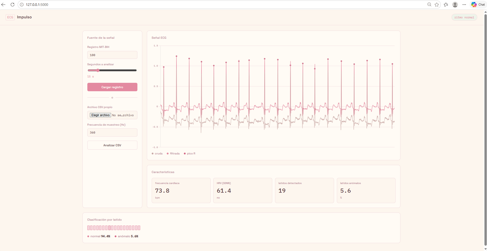

Canva del primer avance de proyecto:

## Dataset: MIT-BIH Arrhythmia Database

### PhysioNet – MIT-BIH Arrhythmia Database

- 48 registros de ECG de pacientes.
- Cada registro contiene aproximadamente 30 minutos de señal ECG.
- Frecuencia de muestreo: 360 Hz.
- Los latidos están anotados por especialistas.
- Permite comparar las detecciones del sistema con anotaciones de referencia.

> **Ejemplo utilizado:** Record 100, 200, 250 y 102
>
> **Entrada → ECG → Procesamiento → Clasificación**

🔗 [MIT-BIH Arrhythmia Database – PhysioNet](https://physionet.org/content/mitdb/1.0.0/)

## Interfaz de la aplicación

