# Análisis de señales EEG - Participante Antonella

## Introducción

En esta sección se analizan los registros EEG correspondientes a la participante **Anto** bajo cuatro condiciones experimentales diferentes:

1. Condición basal.
2. Apertura de ojos y pestañeo.
3. Resolución mental de preguntas.
4. Escucha de música.

Para cada condición se evaluaron diferentes representaciones de la señal EEG, incluyendo la señal temporal original, la señal filtrada, el espectro de frecuencia, la densidad espectral de potencia y la distribución de potencia en las principales bandas EEG.

Las principales bandas consideradas en el análisis son:

| Banda | Rango aproximado | Relación fisiológica general |
|---|---:|---|
| Delta | 0.5 - 4 Hz | Sueño profundo y actividad lenta |
| Theta | 4 - 8 Hz | Somnolencia, memoria y procesamiento interno |
| Alpha | 8 - 13 Hz | Relajación y reposo, especialmente con ojos cerrados |
| Beta | 13 - 30 Hz | Atención, actividad mental y procesamiento cognitivo |
| Gamma | > 30 Hz | Procesamiento cognitivo de mayor frecuencia |

---

# 1. Condición basal

## Señal EEG original

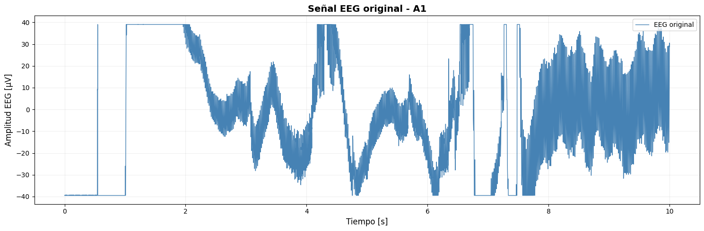

La señal basal representa el estado de referencia de la participante, antes de introducir estímulos o tareas cognitivas específicas.

En el dominio temporal se observa la actividad espontánea del EEG, compuesta por oscilaciones de amplitud variable. Este registro sirve como punto de comparación para las demás condiciones experimentales.

En una condición basal se espera una señal relativamente estable, aunque pueden aparecer fluctuaciones asociadas a movimientos involuntarios, actividad ocular, contracciones musculares o variaciones en el contacto de los electrodos.

---

## Señal EEG filtrada

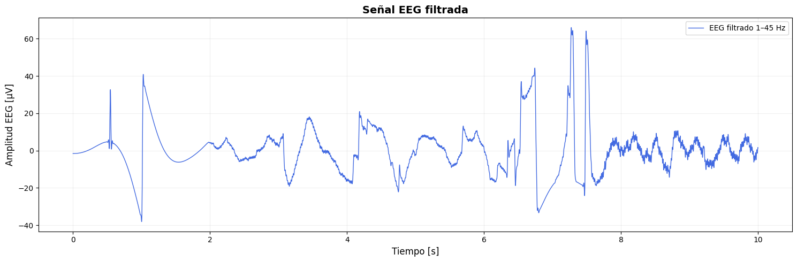

Luego del filtrado se observa una señal más limpia, donde se reducen componentes de muy baja frecuencia, ruido eléctrico y componentes fuera del rango de interés del EEG.

La señal filtrada permite distinguir con mayor claridad las oscilaciones cerebrales que se encuentran dentro del rango fisiológico esperado.

La diferencia entre la señal original y la señal filtrada muestra la importancia del preprocesamiento antes de realizar cualquier análisis espectral.

---

## Espectro de frecuencia

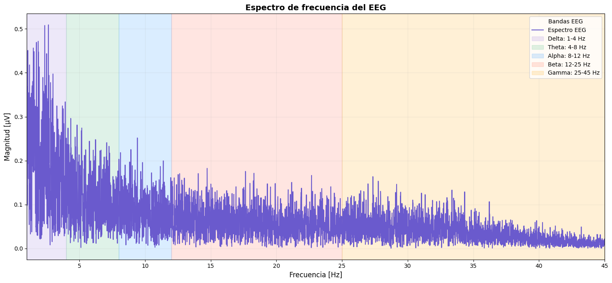

El espectro permite observar qué frecuencias poseen mayor amplitud dentro de la señal.

En el EEG basal, gran parte de la energía suele concentrarse en frecuencias relativamente bajas. Dependiendo del estado de relajación de la participante, pueden observarse componentes relacionadas con las bandas theta y alpha.

No obstante, la presencia de un pico espectral no debe interpretarse de manera aislada, ya que algunos componentes pueden corresponder a interferencias o artefactos.

---

## Densidad espectral de potencia

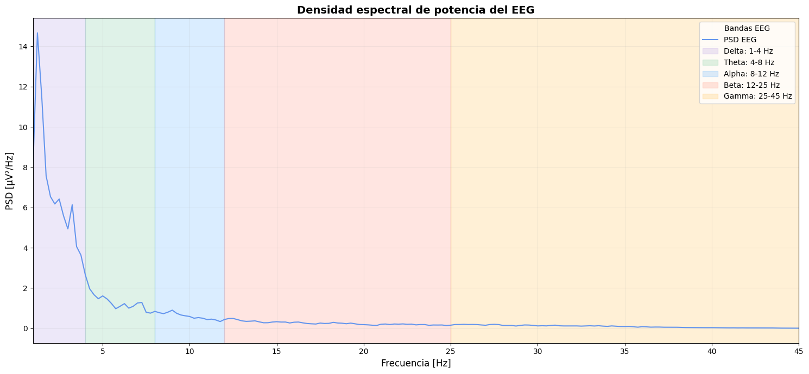

La densidad espectral de potencia, o PSD, muestra cómo se distribuye la potencia de la señal en función de la frecuencia.

Esta representación es especialmente útil en EEG porque permite evaluar qué bandas presentan mayor contribución energética.

En la condición basal se utiliza esta gráfica como referencia para comparar posteriormente los cambios producidos por los estímulos visuales, cognitivos y auditivos.

---

## Distribución de potencia por bandas

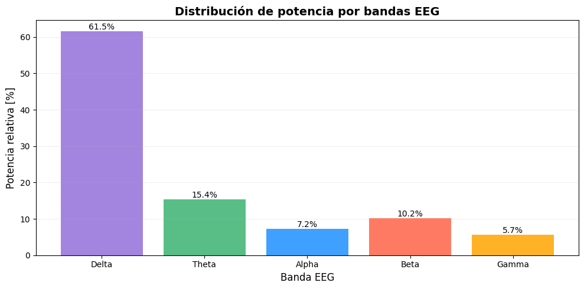

La distribución por bandas resume el contenido espectral del EEG y permite comparar directamente la contribución relativa de delta, theta, alpha, beta y gamma.

Este gráfico funciona como una referencia cuantitativa para analizar si alguna banda aumenta o disminuye durante las otras condiciones experimentales.

---

# 2. Ojos abiertos y pestañeo

## Señal EEG

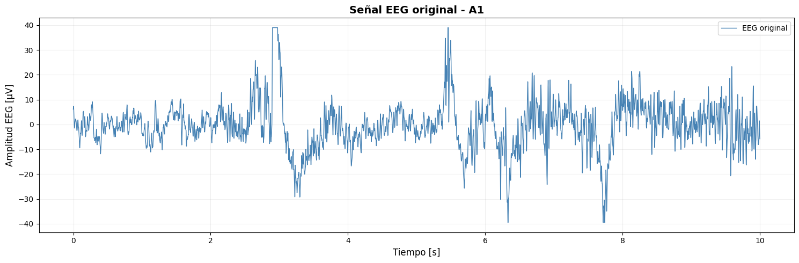

Durante esta condición se observa el EEG mientras la participante mantiene los ojos abiertos y realiza movimientos oculares o pestañeos.

A diferencia de la condición basal, los movimientos de los ojos pueden introducir artefactos importantes en la señal debido a la actividad electrooculográfica.

Los pestañeos pueden generar deflexiones de gran amplitud en el registro temporal debido al movimiento del dipolo eléctrico generado por el ojo.

Por esta razón, los cambios bruscos de amplitud encontrados en esta condición no deben interpretarse necesariamente como actividad cortical.

---

## Señal EEG filtrada

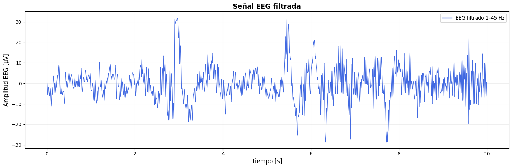

Luego del filtrado, la señal presenta una reducción de componentes indeseadas, aunque algunos artefactos oculares pueden permanecer debido a que su contenido frecuencial puede superponerse con las bandas EEG.

Esta condición demuestra una de las principales dificultades del registro electroencefalográfico: separar la actividad cerebral real de señales fisiológicas externas.

---

## Espectro de frecuencia

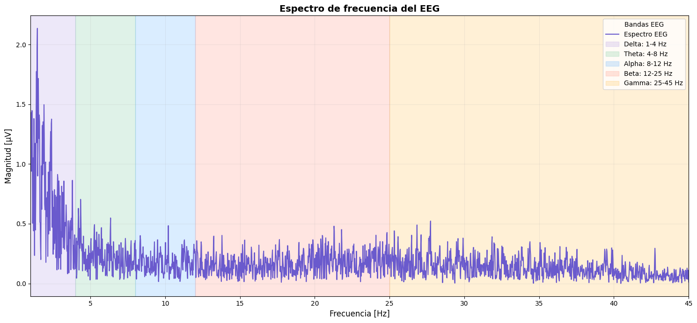

El espectro durante la apertura de los ojos puede presentar diferencias respecto al basal.

Fisiológicamente, la apertura de los ojos suele producir una reducción de la actividad alpha asociada al denominado **bloqueo alpha**, especialmente cuando el sujeto pasa de una condición relajada con ojos cerrados a una condición con mayor estimulación visual.

Además, los movimientos oculares introducen componentes de baja frecuencia que pueden incrementar artificialmente la energía en las regiones bajas del espectro.

---

## Densidad espectral de potencia

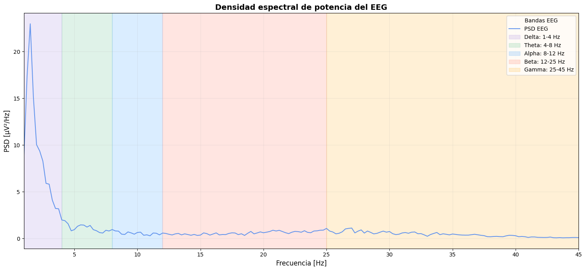

La PSD permite visualizar cómo cambia la distribución energética durante esta condición.

En comparación con el basal, la actividad puede volverse más distribuida debido al procesamiento visual y a la presencia de artefactos oculares.

Debe tenerse especial cuidado al interpretar incrementos en frecuencias bajas, ya que podrían estar relacionados con parpadeos o movimientos oculares.

---

## Distribución de potencia

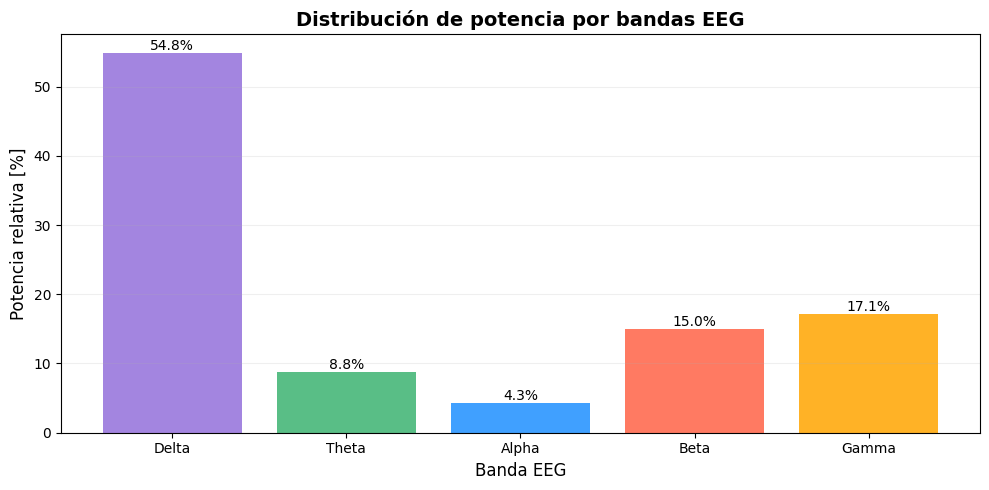

Esta gráfica permite comparar la contribución de cada banda EEG durante la apertura de los ojos.

La comparación con el basal permite identificar posibles cambios en la potencia relativa de alpha, beta y otras bandas.

En particular, una reducción relativa de alpha sería compatible con el aumento del procesamiento visual asociado a la apertura de los ojos.

---

# 3. Actividad cognitiva: preguntas

## Señal EEG

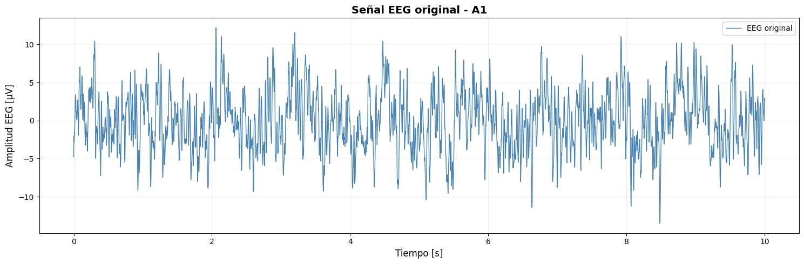

Durante esta condición se realizaron preguntas a la participante y se le indicó que debía pensar en la respuesta sin verbalizarla.

Este procedimiento busca inducir actividad cognitiva relacionada con atención, memoria, comprensión y elaboración mental, evitando al mismo tiempo artefactos musculares asociados al habla.

La señal presenta una actividad EEG continua durante el periodo en que la participante procesa las preguntas.

---

## Señal filtrada

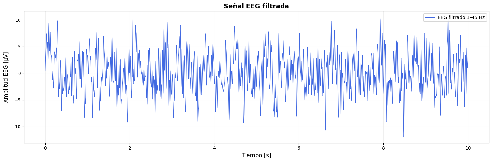

Después del filtrado, se conserva principalmente la actividad dentro del rango fisiológico del EEG.

La señal filtrada facilita la identificación de oscilaciones cerebrales y reduce interferencias externas.

Durante una tarea cognitiva pueden aparecer cambios en las bandas theta y beta relacionados con procesos de memoria de trabajo, atención y procesamiento mental.

---

## Espectro de frecuencia

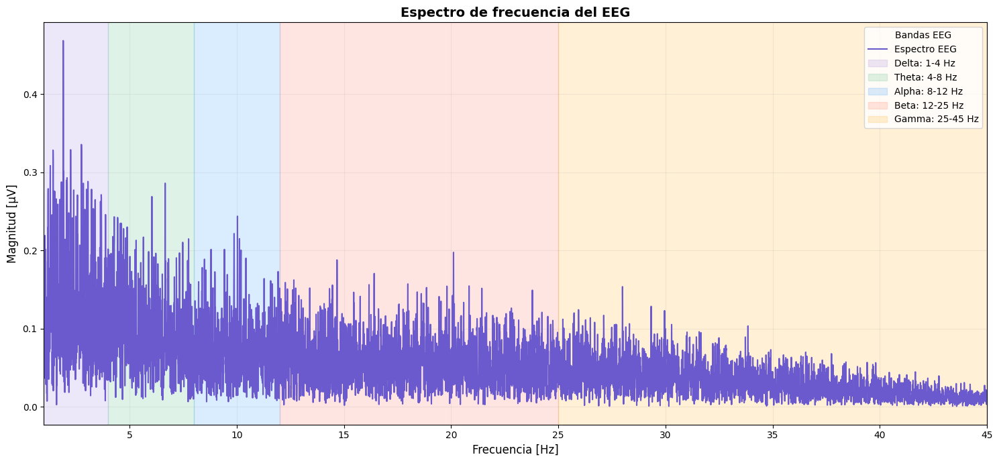

El espectro permite observar qué frecuencias dominan durante el procesamiento de las preguntas.

En comparación con la condición basal, puede existir una redistribución de la energía hacia bandas relacionadas con actividad cognitiva.

La banda beta suele asociarse con atención y procesamiento activo, mientras que cambios en theta también pueden aparecer durante tareas que involucran memoria de trabajo.

Sin embargo, estas relaciones deben interpretarse como tendencias fisiológicas generales y no como una medición directa de pensamientos específicos.

---

## Densidad espectral de potencia

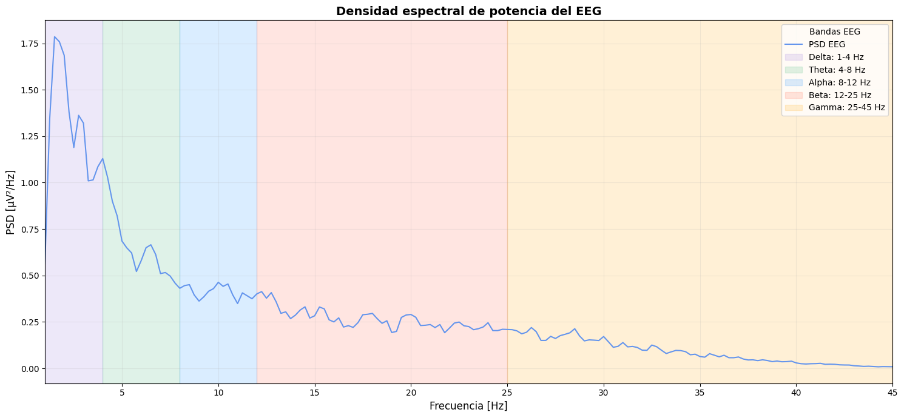

La PSD permite evaluar con mayor claridad la distribución energética durante la tarea cognitiva.

Comparar esta gráfica con la PSD basal permite identificar qué regiones de frecuencia aumentaron o disminuyeron durante el procesamiento mental de las preguntas.

---

## Distribución de potencia

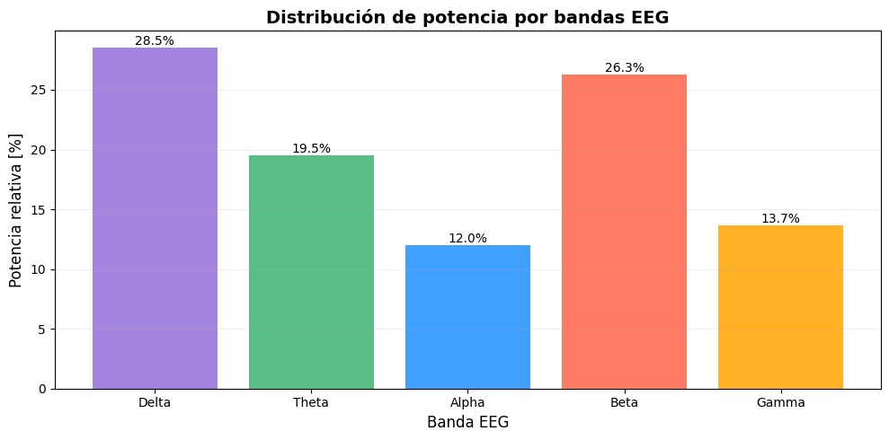

La distribución por bandas facilita la comparación entre la condición cognitiva y la condición basal.

Un incremento relativo de componentes theta o beta podría ser coherente con una mayor demanda de memoria, atención y procesamiento cognitivo.

Sin embargo, la interpretación debe realizarse considerando también la señal temporal y la posible presencia de artefactos.

---

# 4. Actividad con música

## Señal EEG

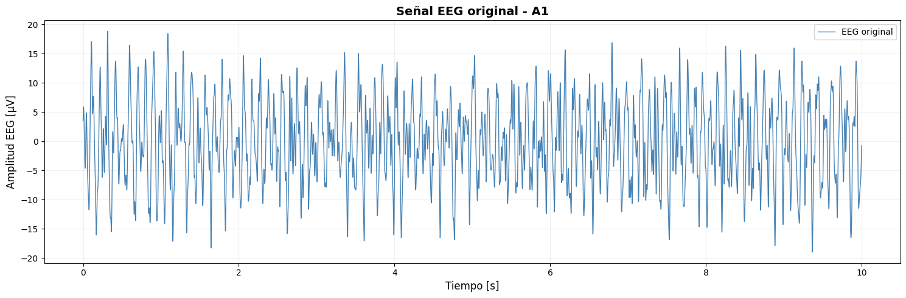

Durante esta etapa la participante estuvo expuesta a un estímulo musical.

La música constituye un estímulo auditivo complejo capaz de involucrar simultáneamente procesos de atención, percepción auditiva, memoria y respuesta emocional.

La señal temporal muestra la actividad EEG registrada durante toda la estimulación musical.

---

## Señal filtrada

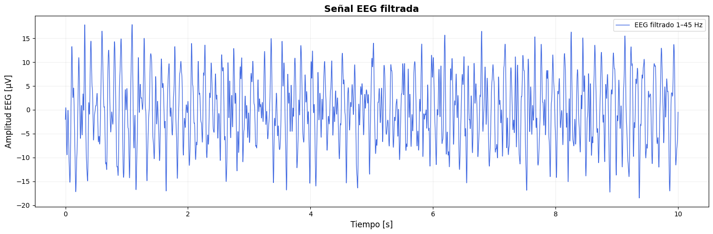

La señal filtrada permite observar con mayor claridad las componentes cerebrales relevantes eliminando parte del ruido y de las frecuencias fuera del rango de interés.

Durante la escucha de música pueden presentarse cambios en diferentes bandas EEG dependiendo del nivel de atención, familiaridad, relajación o respuesta emocional generada por el estímulo.

---

## Espectro de frecuencia

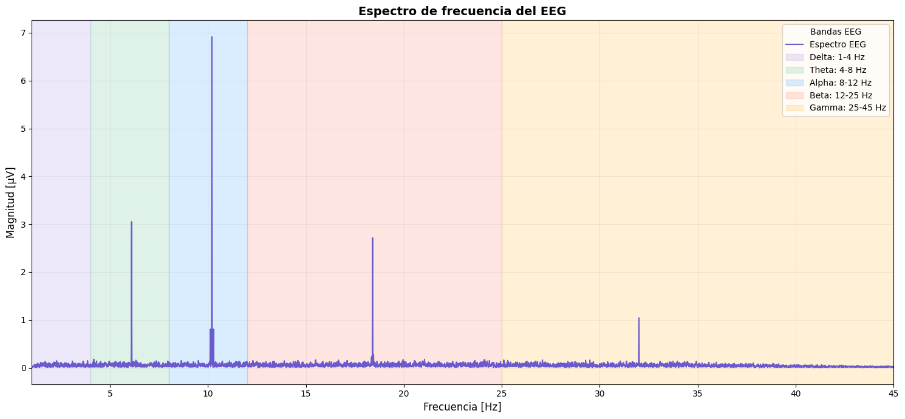

El espectro permite identificar las frecuencias predominantes durante la estimulación musical.

Al comparar este registro con el basal puede observarse si la música produce una redistribución de la energía entre las distintas bandas.

Dependiendo del estado de la participante, puede existir una combinación de actividad relacionada con relajación, atención y procesamiento auditivo.

---

## Densidad espectral de potencia

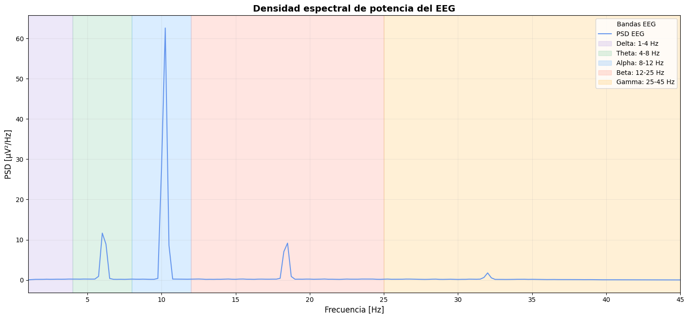

La densidad espectral permite analizar con mayor precisión cómo se distribuye la potencia de la señal durante la escucha musical.

Esta representación puede mostrar cambios con respecto a la condición basal que no son evidentes únicamente observando la señal en el dominio temporal.

---

## Distribución de potencia por bandas

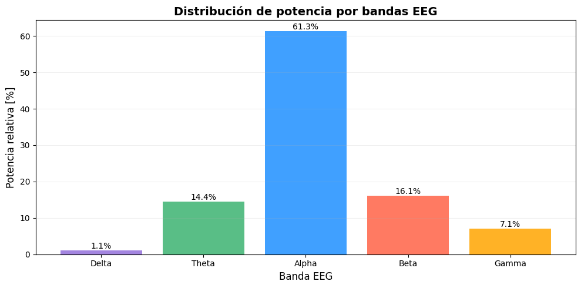

La distribución de potencia permite comparar directamente la participación de las bandas delta, theta, alpha, beta y gamma.

Esta gráfica resulta particularmente útil para evaluar si el estímulo musical produjo un patrón diferente respecto a la condición basal o a la actividad cognitiva.

---

# 5. Comparación general entre condiciones

Las cuatro condiciones muestran diferentes características tanto en el dominio temporal como frecuencial.

| Condición | Característica principal | Interpretación esperada |
|---|---|---|
| Basal | Actividad espontánea y relativamente estable | Referencia fisiológica |
| Ojos abiertos / pestañeo | Mayor presencia de transitorios y artefactos oculares | Procesamiento visual + EOG |
| Preguntas | Actividad asociada a procesamiento mental | Atención, memoria de trabajo y cognición |
| Música | Respuesta a estimulación auditiva | Procesamiento auditivo, atención y respuesta emocional |

La condición basal se utiliza como referencia para interpretar las demás etapas.

Durante la apertura de los ojos, una parte importante de los cambios puede estar relacionada tanto con la actividad visual como con artefactos electrooculográficos.

En la condición de preguntas, las modificaciones espectrales pueden relacionarse con una mayor demanda cognitiva, especialmente en bandas theta y beta.

Finalmente, durante la escucha de música se produce una estimulación auditiva compleja que puede modificar la distribución de potencia en diferentes bandas EEG.

---

# 6. Importancia del análisis temporal y frecuencial

El análisis del EEG no debe realizarse únicamente observando la señal en función del tiempo.

Una señal aparentemente similar entre dos condiciones puede presentar diferencias importantes en el dominio de la frecuencia.

Por esta razón se utilizaron cinco representaciones complementarias:

- Señal EEG original.
- Señal EEG filtrada.
- Espectro de frecuencia.
- Densidad espectral de potencia.
- Distribución de potencia por bandas.

La combinación de estos análisis permite obtener una interpretación más completa de la actividad cerebral registrada.

---

# 7. Consideraciones sobre artefactos

Las señales EEG tienen amplitudes muy pequeñas y son susceptibles a distintas fuentes de interferencia.

Entre los principales artefactos presentes en este experimento se encuentran:

- Parpadeos y movimientos oculares.
- Movimiento de la cabeza.
- Actividad muscular facial.
- Movimiento de los electrodos.
- Variaciones de impedancia electrodo-piel.
- Interferencia eléctrica.
- Ruido de alta frecuencia.

En particular, la condición de ojos abiertos y pestañeo es útil para visualizar cómo la actividad ocular puede modificar considerablemente un registro EEG.

---

# 8. Conclusión

El análisis realizado permite observar que la actividad EEG de la participante cambia en función de la condición experimental.

La condición basal proporciona un punto de referencia sobre la actividad espontánea.

Los registros de ojos abiertos presentan una mayor influencia de artefactos oculares y cambios asociados al procesamiento visual.

La condición de preguntas permite estudiar modificaciones asociadas a atención y procesamiento cognitivo, mientras que la estimulación musical permite evaluar la respuesta cerebral frente a un estímulo auditivo complejo.

El uso conjunto de señales temporales, espectros, densidades espectrales y distribución de potencia permite realizar una interpretación más completa que la simple inspección de la señal cruda.

No obstante, cualquier asociación entre una banda EEG específica y un proceso cognitivo debe interpretarse con cautela, ya que las señales pueden contener artefactos y la actividad cerebral depende de múltiples procesos simultáneos.
