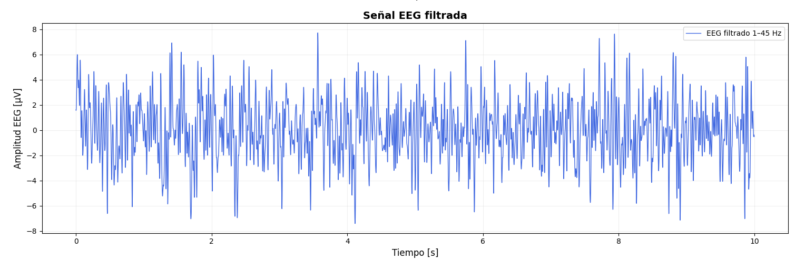
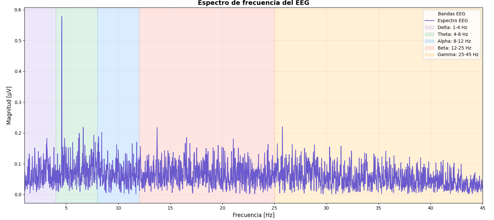
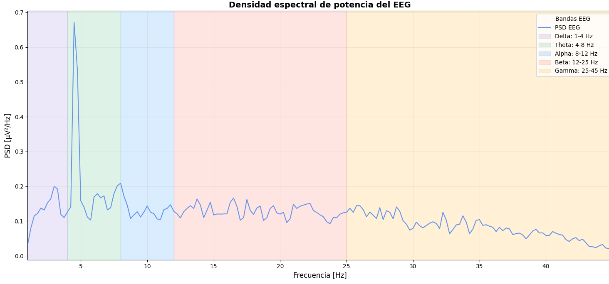
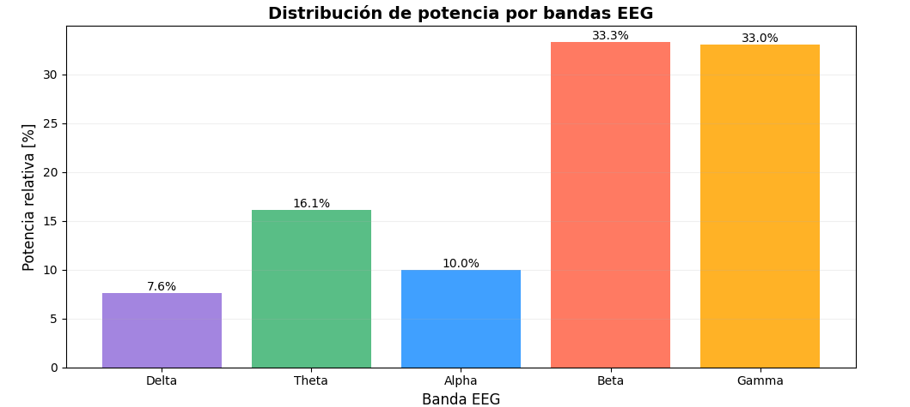
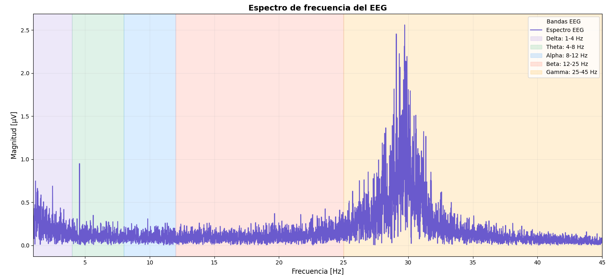
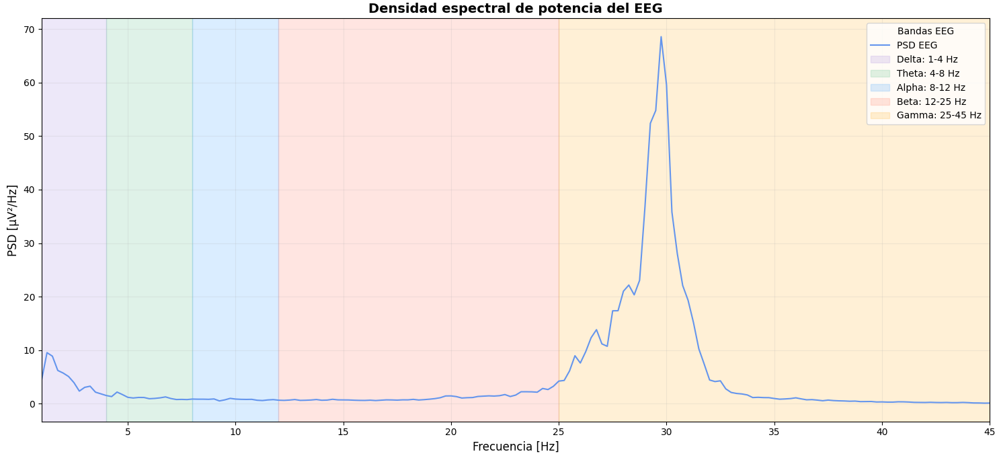
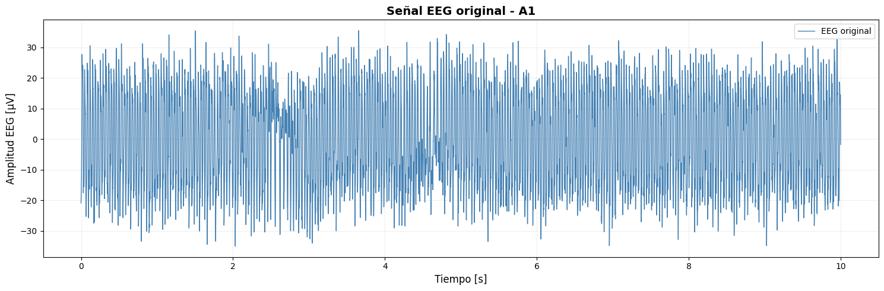
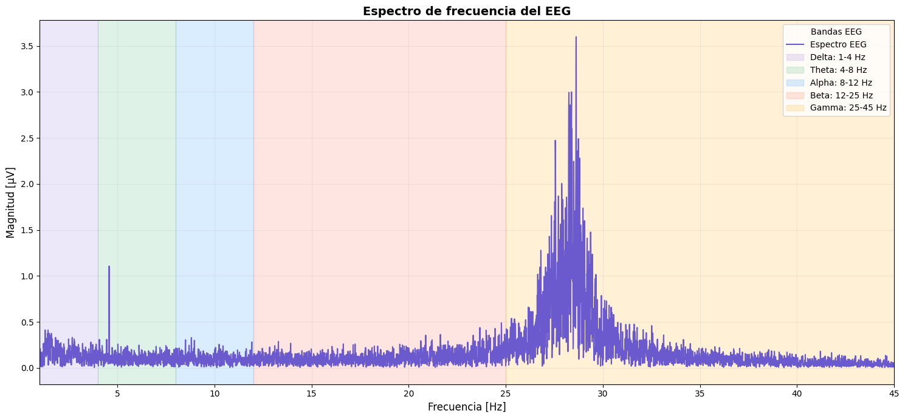
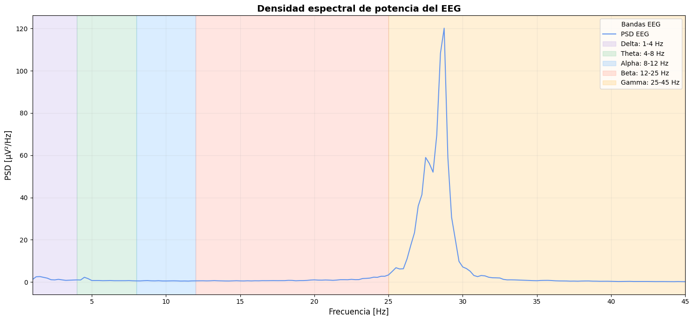
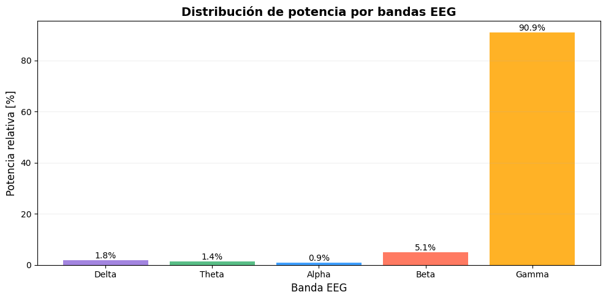

# Análisis de señales EEG - Kimberly

## Introducción

En esta sección se analizan los registros EEG correspondientes a la participante **Kimberly** bajo diferentes condiciones experimentales:

1. Condición basal.
2. Apertura de ojos y pestañeo.
3. Resolución de preguntas complejas.
4. Actividad asociada al estímulo musical.

Para el análisis se consideran diferentes representaciones de la señal EEG, incluyendo la señal temporal, la señal filtrada, el espectro de frecuencia, la densidad espectral de potencia y la distribución de potencia entre las principales bandas cerebrales.

Las bandas EEG consideradas son:

| Banda | Rango aproximado | Asociación fisiológica general |
|---|---:|---|
| Delta | 0.5 - 4 Hz | Actividad lenta y sueño profundo |
| Theta | 4 - 8 Hz | Memoria, somnolencia y procesamiento interno |
| Alpha | 8 - 13 Hz | Relajación y reposo |
| Beta | 13 - 30 Hz | Atención y procesamiento cognitivo |
| Gamma | > 30 Hz | Procesamiento de mayor frecuencia |

---

# 1. Condición basal

## Señal EEG original

La condición basal constituye el registro de referencia de la participante antes de realizar tareas cognitivas o recibir estímulos externos específicos.

La señal temporal muestra las variaciones espontáneas de la actividad eléctrica cerebral. Este registro permite establecer un punto de comparación para evaluar posteriormente los cambios observados durante el pestañeo, las preguntas complejas y la estimulación auditiva.

Durante una condición basal pueden observarse oscilaciones de amplitud relativamente estable, aunque también pueden aparecer variaciones asociadas a movimiento, parpadeo, actividad muscular o cambios en el contacto de los electrodos.

---

## Señal EEG filtrada

Luego del procesamiento, la señal filtrada presenta una reducción de componentes no deseadas y permite observar con mayor claridad las oscilaciones correspondientes al EEG.

El filtrado es importante debido a que las señales electroencefalográficas presentan amplitudes pequeñas y pueden ser fácilmente contaminadas por ruido eléctrico, movimiento o actividad muscular.

La comparación entre la señal original y la señal filtrada permite evaluar el efecto del preprocesamiento sobre el registro.

---

## Espectro de frecuencia

El espectro muestra la contribución de las distintas frecuencias presentes en la señal EEG basal.

Esta representación permite identificar las regiones frecuenciales con mayor contenido energético y posteriormente relacionarlas con las bandas delta, theta, alpha, beta y gamma.

En una condición de reposo pueden encontrarse componentes importantes en las regiones de baja y media frecuencia, aunque la interpretación depende de las condiciones específicas de adquisición.

---

## Densidad espectral de potencia

La densidad espectral de potencia permite observar cómo se distribuye la energía de la señal a lo largo de la frecuencia.

A diferencia del espectro de amplitud, esta representación facilita la comparación de la contribución energética de las diferentes bandas EEG.

El registro basal sirve como referencia para determinar posteriormente si existe una redistribución de potencia al introducir tareas cognitivas o estímulos externos.

---

## Distribución de potencia

La distribución de potencia permite visualizar de manera resumida la contribución relativa de cada banda de frecuencia.

Este gráfico es especialmente útil para comparar la condición basal con las condiciones de mayor demanda cognitiva o sensorial.

---

# 2. Ojos abiertos y pestañeo

## Registro EEG durante pestañeo

Durante esta etapa se registró la actividad EEG mientras la participante realizaba apertura de ojos y pestañeos.

Los movimientos oculares producen potenciales eléctricos que pueden ser detectados por los electrodos de EEG. Por esta razón, los pestañeos suelen generar deflexiones de amplitud considerablemente mayor que la actividad cerebral espontánea.

Los cambios bruscos observados durante esta condición pueden estar relacionados con:

- Pestañeos.
- Movimiento del globo ocular.
- Movimiento facial.
- Actividad muscular periocular.
- Cambios momentáneos en el contacto electrodo-piel.

Por ello, estas deflexiones deben interpretarse principalmente como **posibles artefactos electrooculográficos**, y no necesariamente como cambios corticales.

Esta condición resulta útil para evidenciar la sensibilidad del EEG frente a señales fisiológicas externas.

---

# 3. Preguntas complejas

Durante esta etapa se realizaron preguntas que requerían mayor procesamiento mental por parte de la participante. Se buscó generar una condición de mayor demanda cognitiva asociada con procesos como atención, memoria de trabajo, recuperación de información y elaboración de respuestas.

## Señal EEG original

La señal temporal presenta la actividad registrada mientras la participante procesaba las preguntas.

A diferencia de una condición basal, durante una tarea cognitiva pueden producirse modificaciones en la actividad cerebral relacionadas con la atención sostenida y la elaboración mental.

No obstante, las variaciones temporales por sí solas no permiten determinar qué bandas EEG están involucradas, por lo que es necesario complementar el análisis con información espectral.

---

## Señal EEG filtrada

Luego del filtrado se conservan principalmente las componentes de interés del EEG, reduciendo parte del ruido presente en la señal original.

Esto facilita la identificación de patrones oscilatorios y mejora la calidad del análisis en frecuencia.

La señal filtrada permite observar de manera más clara los cambios producidos durante el procesamiento mental de las preguntas.

---

## Espectro de frecuencia

El espectro permite identificar las frecuencias predominantes durante la tarea cognitiva.

Durante actividades de atención y procesamiento mental pueden producirse modificaciones en bandas como theta y beta.

La banda theta puede relacionarse con procesos de memoria de trabajo, mientras que la actividad beta suele asociarse con atención y procesamiento activo.

Sin embargo, estas asociaciones representan tendencias fisiológicas generales y no deben interpretarse como una medición directa del contenido de los pensamientos.

---

## Densidad espectral de potencia

La densidad espectral permite observar la distribución energética de la señal durante la resolución de las preguntas.

Comparando esta gráfica con la condición basal se puede evaluar si determinadas regiones frecuenciales presentan una mayor o menor contribución durante la tarea cognitiva.

---

## Distribución de potencia por bandas

La distribución de potencia resume la participación relativa de las principales bandas EEG.

Esta representación permite comparar de manera más directa la condición cognitiva con el registro basal.

Un cambio en la contribución relativa de theta o beta podría ser compatible con un aumento de la demanda cognitiva, aunque siempre debe interpretarse junto con el resto de las representaciones.

---

# 4. Actividad asociada al estímulo musical

> **Nota:** Los archivos almacenados actualmente dentro de la carpeta `Actividad_musica_Kim` utilizan nombres relacionados con “preguntas”. El análisis se mantiene asociado a la condición experimental indicada por la carpeta, pero sería recomendable renombrar posteriormente los archivos para evitar confusión.

## Señal EEG

Durante esta etapa la participante estuvo expuesta a un estímulo auditivo musical.

La música constituye un estímulo complejo que puede involucrar simultáneamente percepción auditiva, atención, memoria, respuesta emocional y procesamiento temporal.

La señal EEG temporal permite observar las variaciones de actividad registradas durante el periodo de estimulación.

---

## Señal procesada

El procesamiento de la señal permite reducir componentes no deseadas y facilita la visualización de las oscilaciones presentes durante la estimulación musical.

La respuesta EEG frente a música puede variar dependiendo del nivel de atención, familiaridad con el estímulo, estado emocional y nivel de relajación de la participante.

---

## Espectro de frecuencia

El espectro permite identificar qué regiones frecuenciales presentan una mayor contribución durante la estimulación auditiva.

Comparando este registro con la condición basal puede evaluarse si existe una redistribución del contenido frecuencial asociada al estímulo musical.

No obstante, para establecer diferencias cuantitativas sería necesario comparar directamente los valores de potencia obtenidos en cada banda.

---

## Densidad espectral

La densidad espectral permite analizar la distribución energética de la señal durante la exposición musical.

Esta representación complementa el análisis temporal, ya que permite identificar cambios que no necesariamente son evidentes al observar únicamente la amplitud de la señal.

---

## Distribución de potencia

La distribución por bandas permite visualizar la contribución relativa de delta, theta, alpha, beta y gamma durante la actividad musical.

La comparación con la condición basal y la condición cognitiva permite evaluar si el estímulo musical produjo una distribución de potencia distinta.

---

# 5. Comparación general de las condiciones

| Condición | Característica principal | Interpretación general |
|---|---|---|
| Basal | Actividad espontánea | Referencia fisiológica |
| Ojos abiertos / pestañeo | Deflexiones asociadas a actividad ocular | Artefactos EOG y procesamiento visual |
| Preguntas complejas | Mayor demanda cognitiva | Atención, memoria y procesamiento mental |
| Música | Estimulación auditiva | Procesamiento auditivo y respuesta emocional |

La condición basal constituye el punto de comparación principal.

Durante la condición de pestañeo se observa una mayor influencia de la actividad ocular, lo que demuestra cómo los artefactos fisiológicos pueden alterar significativamente un registro EEG.

Durante las preguntas complejas se busca evaluar cambios asociados con una mayor demanda cognitiva.

Por otro lado, la condición musical permite estudiar cómo un estímulo auditivo complejo puede modificar la dinámica temporal y espectral del EEG.

---

# 6. Análisis temporal y espectral

La interpretación del EEG debe combinar diferentes representaciones.

La señal temporal permite identificar:

- Cambios de amplitud.
- Eventos transitorios.
- Artefactos.
- Variaciones en el tiempo.

El análisis espectral permite identificar:

- Frecuencias dominantes.
- Distribución de energía.
- Potencia de las bandas EEG.
- Diferencias entre condiciones experimentales.

Por esta razón, la combinación de ambos dominios proporciona una interpretación más completa del registro.

---

# 7. Consideraciones sobre artefactos

Las señales EEG pueden estar contaminadas por diferentes fuentes externas a la actividad cortical.

Entre los principales artefactos que pueden aparecer durante este experimento se encuentran:

- Parpadeos.
- Movimientos oculares.
- Actividad muscular facial.
- Movimiento de la cabeza.
- Cambios en la impedancia electrodo-piel.
- Interferencia eléctrica.
- Ruido de alta frecuencia.

La identificación de estos artefactos es fundamental para evitar interpretar actividad no cerebral como cambios en el EEG.

---

# 8. Conclusión

Los registros obtenidos permiten observar diferencias entre las condiciones experimentales evaluadas en Kimberly.

La condición basal proporciona una referencia de la actividad EEG espontánea.

La apertura de ojos y los pestañeos generan variaciones importantes relacionadas principalmente con actividad electrooculográfica y artefactos fisiológicos.

Durante la resolución de preguntas complejas se registra una condición de mayor demanda cognitiva, en la que pueden producirse cambios en la distribución de potencia de bandas relacionadas con atención y memoria de trabajo.

Finalmente, la estimulación musical permite evaluar la respuesta cerebral frente a un estímulo auditivo complejo y comparar su comportamiento temporal y espectral con las demás condiciones.

El análisis conjunto de la señal temporal, la señal filtrada, el espectro y la densidad de potencia permite realizar una interpretación más completa del EEG que la simple inspección visual de la señal cruda.
